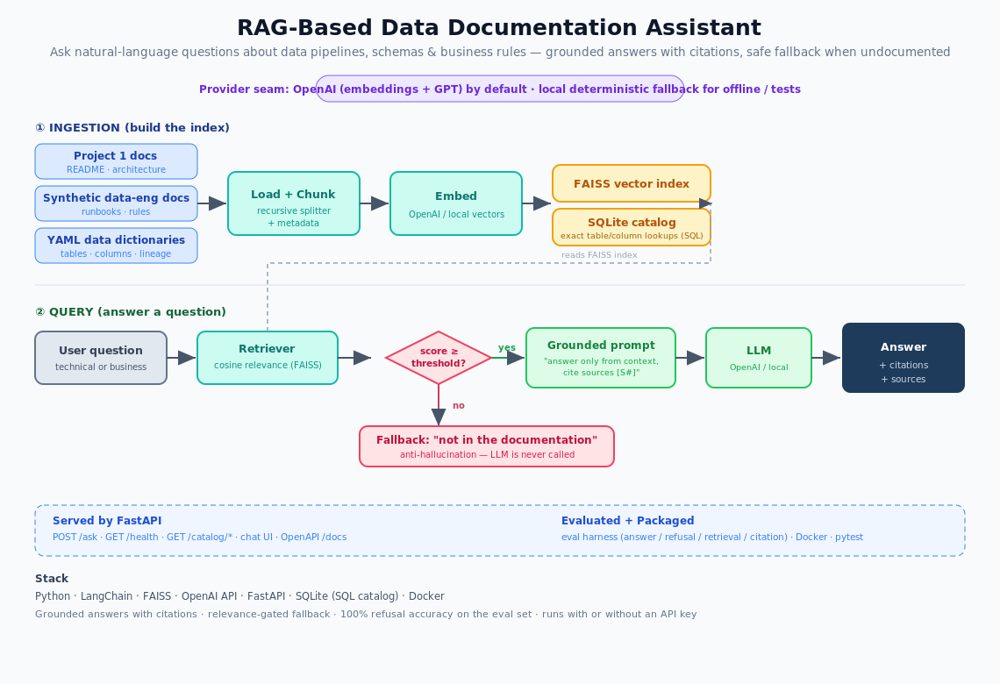

<h1 align="center">🔎 RAG-Based Data Documentation Assistant</h1>

<p align="center">
  Ask natural-language questions about data pipelines, schemas, data dictionaries
  and business rules — and get answers that are <b>grounded in the docs, with
  citations</b>, that <b>refuse to guess</b> when the answer isn't documented.
</p>

<p align="center">
  
  
  
  
  
  
  
</p>

<p align="center"></p>

---

## Why this project

Every data team drowns in tribal knowledge — what a table means, how a metric is
defined, why a pipeline does what it does. This assistant makes that
documentation *queryable*, the right way: **retrieval-augmented generation with
citations and a hard anti-hallucination gate.**

"Chat with your docs" is easy to fake; the hard, hireable part is making it
**trustworthy**. This project focuses there: a relevance gate that **refuses
out-of-scope questions before the LLM is ever called**, source-cited answers,
and an **evaluation harness** that measures it.

It's **OpenAI-powered**, and engineered so the entire pipeline — ingestion,
retrieval, API, and tests — also runs **offline without an API key** via a
deterministic local provider. That's what lets anyone clone and run it.

## What it demonstrates

- **RAG done properly** — LangChain ingestion → FAISS vector search → grounded,
  cited generation, with a relevance threshold that gates hallucination.
- **Retrieval + structured lookups** — semantic search (FAISS) *plus* an exact
  **SQL data catalog** (SQLite) for table/column/lineage questions.
- **Production surface** — a **FastAPI** service (`/ask`, `/health`,
  `/catalog/*`, OpenAPI `/docs`) with a clean chat UI, containerized with Docker.
- **Evaluation** — answer accuracy, **refusal accuracy** (anti-hallucination),
  retrieval hit-rate, citation coverage.
- **Engineering hygiene** — provider abstraction, config-driven, `make`-driven,
  and a self-contained test suite that needs no API key.

## Quickstart

```bash
python -m venv .venv && source .venv/bin/activate
make setup

# (optional) real answers: echo "OPENAI_API_KEY=sk-..." > .env
# without a key it runs on the local deterministic provider automatically

make ingest      # build the FAISS index + SQLite catalog
make serve       # FastAPI + chat UI at http://localhost:8000  (docs at /docs)
```

Ask from the CLI:

```bash
make ask q="How is on-time percentage defined?"
```

Or via the API:

```bash
curl -s localhost:8000/ask -H 'content-type: application/json' \
  -d '{"question":"What is the grain of the fact_flights table?"}' | jq
```

Run it in Docker: `make docker-up`.

## Grounding & anti-hallucination

1. The retriever scores each chunk with a cosine relevance in `[0,1]`.
2. Chunks below the threshold are dropped. **If none remain, the assistant
   returns a safe fallback and never calls the LLM.**
3. Otherwise the LLM is prompted to answer **only** from the retrieved context
   and cite sources as `[S#]`; the response carries those citations.

## Retrieval: hybrid BM25 + vector

Retrieval merges FAISS vector search with **BM25 lexical search** via
Reciprocal Rank Fusion. The anti-hallucination gate uses **two signals**: the
absolute vector relevance threshold *and* a query-term coverage check (enough
of the question's content words must actually appear in the retrieved context
— this kills vocabulary-adjacent traps like "airline baggage fees").

## Evaluation

`make eval` runs a **102-question labeled set** (72 answerable spanning 12 real
documents + **30 out-of-scope traps**, many deliberately vocabulary-adjacent).
Benchmark on the local provider (`python -m eval.evaluate --compare`):

| Metric | Vector-only | Hybrid (BM25 + vector) |
|---|---|---|
| Retrieval hit-rate | 84% (61/73) | **95% (69/73)** |
| Answer accuracy | 81% (59/73) | **89% (65/73)** |
| Refusal accuracy | 97% (29/30) | **93% (28/30)** |
| Citation coverage | 100% | **100%** |

Honest read: hybrid recovers +8pts of answers and +11pts of retrieval at a
−4pt refusal trade-off; the two-signal gate keeps traps ≥93% refused where a
naive similarity threshold alone scored **40%** on the same trap set. OpenAI
embeddings push retrieval higher still.

## Project structure

```
rag-data-docs-assistant/
├── knowledge_base/       # Project 1 docs + synthetic data-eng docs + YAML dictionaries
├── app/
│   ├── providers.py      # OpenAI | local embeddings + LLM (one interface)
│   ├── ingest.py         # load → chunk → embed → FAISS + build SQLite catalog
│   ├── retriever.py      # FAISS search + cosine relevance scoring
│   ├── rag.py            # grounded prompt, citations, anti-hallucination fallback
│   ├── catalog.py        # SQL data dictionary (tables / columns / lineage)
│   └── api.py            # FastAPI service
├── ui/index.html         # chat UI
├── eval/                 # labeled questions + evaluation harness
├── tests/                # self-contained pytest suite (no API key needed)
├── docs/                 # architecture write-up + diagram
└── Dockerfile / docker-compose.yml / Makefile
```

## Tech stack

**Python · LangChain · FAISS · OpenAI API · FastAPI · SQLite · Docker · Pydantic**

## Roadmap

- Hybrid retrieval (BM25 + vector) and a reranker to raise hit-rate
- Managed vector store (pgvector / Pinecone) for larger corpora
- Streaming responses + query/feedback logging
- Expand the eval set into a CI regression gate

---

<p align="center"><i>Built by Dhanush Battina · companion to the <a href="https://github.com/battina1999/airline-data-platform">Airline Data Platform</a></i></p>
